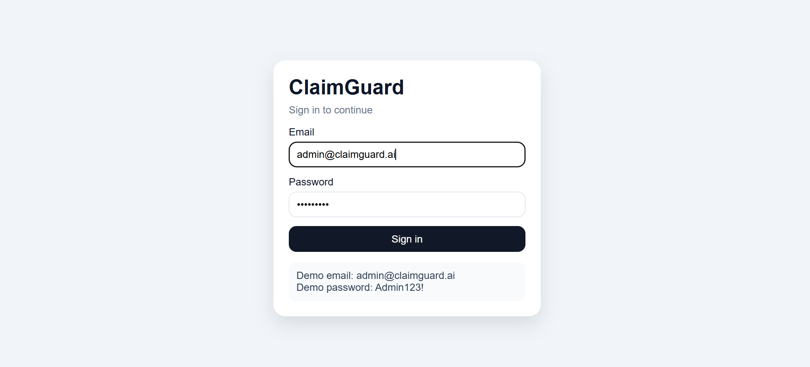
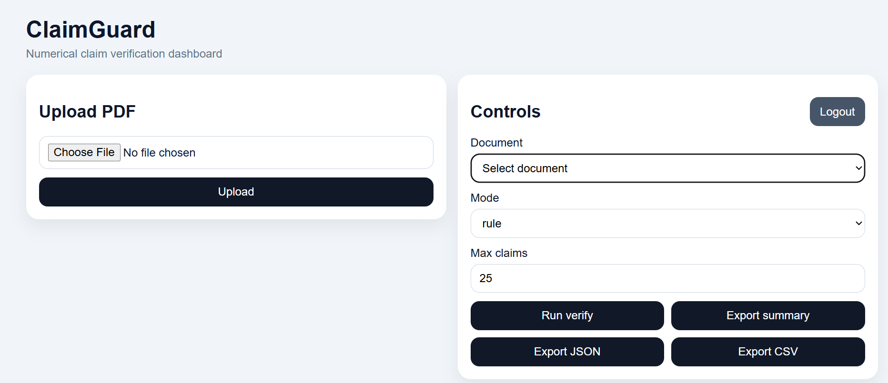

# ClaimGuard

ClaimGuard is a document intelligence system for verifying numerical claims in PDF documents. It processes reports, research papers, and structured business documents, then checks whether written numerical statements are supported by evidence found inside the same document.

The system extracts meaningful claims, retrieves related evidence from text and tables, assigns a verification verdict, and provides exportable outputs for review.

## Screenshots

### Login Page



### Dashboard



## Overview

Many reports and research documents contain important numerical statements such as percentages, counts, rankings, growth values, financial figures, and performance metrics. These statements are often repeated in executive summaries, discussion sections, or conclusions. Manual validation is slow and error prone.

ClaimGuard addresses this problem through an end to end verification pipeline. It reads a PDF, extracts page level text, applies OCR when needed, identifies numerical claims, searches for matching evidence, and classifies each claim as **Supported**, **Contradicted**, or **Insufficient**.

## Current Implementation Status

The current version is a working research MVP with the following capabilities:

1. FastAPI based backend
2. Angular based frontend
3. LangGraph based verification workflow
4. OCR fallback for scan like pages
5. Rule based and Gemini based claim extraction
6. Text based and basic table based evidence verification
7. Result caching and export support

At this stage, LangGraph is actively used in the verification pipeline. The ingestion and parsing stages are still managed through the FastAPI service layer.

## Key Features

1. PDF upload and document ingestion
2. Native PDF text extraction
3. OCR fallback for scan like pages
4. Page image rendering for later visual analysis
5. Resolved page text selection between native text and OCR text
6. Numerical claim extraction in rule mode and Gemini mode
7. Claim cleanup through filtering, deduplication, and prioritization
8. Evidence retrieval from text and table rows
9. Claim verification with transparent evidence matching
10. Result caching for faster repeated runs
11. JSON and CSV export support
12. Angular dashboard for upload, verification, and export

## How It Works

### 1. Document Ingestion
A user uploads a PDF through the API or the frontend interface. The file is stored locally for processing.

### 2. Native PDF Parsing
The system reads the document using a native parser and extracts:

1. document metadata
2. page count
3. page previews
4. full page text

This is the first choice because machine readable PDF text is usually faster and more accurate than OCR.

### 3. Page Rendering
Each page is converted into an image and stored locally. These images are used later for OCR fallback and future visual modules.

### 4. OCR Fallback
If a page contains very little native text, ClaimGuard marks it as scan like and applies OCR to recover readable text.

### 5. Final Page Text Resolution
For each page, the system decides whether to use native PDF text or OCR text. The selected result becomes the resolved page text for later stages.

### 6. Table Extraction
ClaimGuard attempts to detect structured tables from the PDF. If tables are found, they are converted into row based records containing page number, table index, row index, headers, values, and row text.

### 7. Claim Extraction
The system extracts meaningful numerical claims from the resolved page text.

Two modes are supported:

1. **Rule mode**
2. **Gemini mode**

The extractor focuses on claims such as:

1. percentages
2. currency values
3. counts
4. trends
5. comparisons
6. rankings

Noise such as citation numbers, section numbers, page headers, author affiliations, DOI values, and model version names is filtered as much as possible.

### 8. Claim Post Processing
Extracted claims pass through a cleanup stage. This stage removes weak claims, merges duplicates, and prioritizes stronger claims. This improves both speed and output quality.

### 9. Evidence Indexing
ClaimGuard builds searchable evidence indexes from:

1. page level text sentences
2. extracted table rows

These indexes are organized by page so that verification focuses on nearby evidence rather than scanning the full document every time.

### 10. LangGraph Based Verification Workflow
The verification stage is implemented with LangGraph.

The current graph contains these nodes:

1. `load_document`
2. `extract_claims`
3. `verify_claims`
4. `finalize_response`

This graph loads the document, extracts claims, verifies them against available evidence, and prepares the final API response.

### 11. Claim Verification
Each claim is checked against candidate evidence using:

1. keyword overlap
2. page relevance
3. numerical similarity
4. unit compatibility

The system then assigns one of three verdicts:

1. **Supported**
2. **Contradicted**
3. **Insufficient**

### 12. Evidence Linking
For each verified claim, ClaimGuard stores the strongest evidence match. Evidence may come from a sentence or a table row. The response includes page number, evidence text, confidence score, and notes.

### 13. Caching
To avoid repeated computation, the system caches:

1. extracted claims
2. verification results

This improves response time, especially in Gemini mode.

### 14. Export
Results can be exported as:

1. summary JSON
2. full verification JSON
3. verification CSV

These outputs are useful for research review, reporting, or audit style workflows.

### 15. Frontend Review Interface
The Angular frontend allows users to:

1. sign in through a demo authentication flow
2. upload a PDF
3. select a processed document
4. run verification
5. inspect supported, contradicted, and insufficient claims
6. export results

## Verification Labels

### Supported
The claim is backed by related evidence in the document.

### Contradicted
The claim is strongly related to nearby evidence, but the numerical value conflicts with that evidence.

### Insufficient
The system cannot find enough reliable evidence to confirm or reject the claim.

## Tech Stack

### Backend
1. Python
2. FastAPI
3. LangGraph
4. PyMuPDF
5. PaddleOCR
6. Google Gemini API
7. Pydantic

### Frontend
1. Angular 21+

### Storage
1. Local file based storage for uploaded files
2. Parsed document cache
3. Claim cache
4. Verification cache
5. Export files

## Project Structure

```text
ClaimGuard/
├── app/
│   ├── api/
│   │   └── routes/
│   ├── core/
│   ├── graph/
│   ├── ocr/
│   ├── parsers/
│   ├── schemas/
│   ├── services/
│   ├── storage/
│   └── main.py
├── data/
│   ├── raw/
│   ├── pages/
│   ├── parsed/
│   └── exports/
├── ClaimGurdUI/
├── docs/
│   └── images/
└── README.md